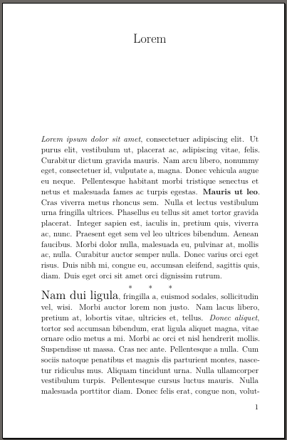

# FiMFic2PDF

Renders fan fiction stories as PDF.

Examples:
| Novel class | Book class |
| ----------- | ---------- |
|  |  |
| [Complete PDF](examples/novel.pdf) | [Complete PDF](examples/book.pdf) |

Supported archives:
* [FiMFiction](https://www.fimfiction.net/)
* [Archive Of Our Own](https://archiveofourown.org/)

Formatting on AO3 is much less uniform than on FiMFiction, so each
story will probably require some individual changes.

Supported classes:

* [book](https://ctan.org/pkg/book): standard LaTeX book class.
* [novel](https://ctan.org/pkg/novel): class specifically for
  print-on-demand fiction.

Executables are named as `archive2class`. Full list:
* `fimfic2book`
* `fimfic2novel`
* `ao32book`
* `ao32novel`

## Requirements

* [Ruby 3](https://www.ruby-lang.org/en/)
  * [httparty](https://www.johnnunemaker.com/httparty/)
  * [nokogiri](https://nokogiri.org/)
  * [rubyzip](https://rubygems.org/gems/rubyzip)
* A complete TeXLive installation. All LaTeX packages used are part of
  TeXLive, but may not be a part of your distribution's default
  packaging. In particular, the "novel" class seems to be packaged in
  `texlive-publishers` in several different Linux distributions.
  * [XeLaTeX](https://ctan.org/pkg/xetex) for the "book" class
  * [LuaLaTeX](http://luatex.org/) for the "novel" class

## Installation

```sh
gem build fimfic2pdf.gemspec
gem install ./fimfic2pdf-*.gem
```

## Basic usage

Run `archive2class -i LINK`, where `archive2class` is one of the
executables in the list above, and `LINK` is a link to the story's
page on the archive.

A whole lot of output will be generated, which you don't need to care
about unless something goes wrong.

The second to last line printed will tell you that the PDF was saved
as `ID/author-title-volume.pdf`, where `ID` is the numbers in the URL,
after `/story/` or `/works/`. You can also use just this ID when
running the program instead of the entire link.

## Advanced usage

Common options for all executables:

```
Usage: fimfic2book -i ID[,ID...] [options]

Main options

    -i, --id ID,ID,...               story ID(s)
    -t, --retransform                re-parse the HTML and re-transform to LaTeX, losing manual changes

    -V, --version                    display version information
    -h, --help                       display usage information
```

Formatting options differ per class. Changing these have no effect
unless also specifying `-t/--retransform`, losing manual changes.

Formatting options for the "book" class:
```
    -b, --barred-blockquotes         put vertical bars in the left margin of block quotes
    -c, --no-chapter                 disable "Chapter X" in chapter titles
    -n, --authors-notes STYLE        handle author's notes: remove (default), plain
    -o, --no-toc                     disable table of contents
    -p, --prettify-single-quotes     change ASCII single quotation marks to Unicode ones
    -q, --prettify-quotes            change ASCII quotation marks to Unicode ones
    -s, --hr-style STYLE             style of <hr> section breaks: asterism (default), fleuron, line, or scrollwork
    -u, --underline STYLE            how to render underlined text: fancy (default), simple, italic, or regular
    -v, --volumes START1-END1,...    split story into multiple volumes
    -y, --hr-symbol SYMBOL           symbol number for scrollwork or fleuron
```

Formatting options for the "novel" class:
```
    -a, --anthology-title TITLE      title to use for anthology
    -f, --frontmatter                include front matter pages (title, copyright, dedication, etc.)
    -p, --prettify-single-quotes     change ASCII single quotation marks to Unicode ones
    -q, --prettify-quotes            change ASCII quotation marks to Unicode ones
    -s, --hr-style STYLE             style of <hr> section breaks: asterism, scenebreak,
                                     sceneline, or scenestars (default)
    -v, --volumes START1-END1,...    split story into multiple volumes
```

### Files

Files are saved in a working directory named `./<ID>/`. Generated
LaTeX code is stored per chapter in files named `chapter-N.tex`, with
global styles specified in `template.tex`.

### Manual download

If the story is inaccessible to an anonymous guest, because it can
only be read when logged in, download the epub file manually through
your web browser and save it as `./<ID>/<filename>.epub`.

### Updating the PDF

When run multiple times:

* By default, only re-renders the PDF, including any manual changes
  made to the generated LaTeX code.
* To re-parse the HTML and re-transform to LaTeX, losing any manual
  changes, use the `-t/--retransform` flag.
* To re-unpack the EPUB file and start over, remove the file
  `./<ID>/config.yaml`.

To change any formatting options, `-t/--retransform` must be
specified, which loses any manual changes.

### Graphical editing

If you wish to use a graphical editor to change the generated LaTeX
code (instead of using a text editor an re-running this tool),
[TeXstudio](https://www.texstudio.org/) seems to have the easiest time
dealing with the generated document structure. You must do two things
for it to work:

1. Open the file `ID/author-title-volume.tex` first, so TeXstudio
   knows which file to begin with. From there, use the structure tree
   view on the left side of the window to open `volX-chapters.tex` and
   then `chapter-Y.tex`.

2. If you are using the "novel" class, go to Options → Configure
   TeXstudio → Build → Default Compiler and change the compiler to
   LuaLaTex.

### Anthologies

If multiple IDs specified, writes an anthology in the current working
directory consisting of the identified stories. For the "novel" class,
a title must be supplied.

### Volumes

By default, a single PDF with all chapters is produced, and a warning
printed if it is excessively long for a single volume. For splitting
into mutiple volumes, give the range of chapters for each volume,
e.g.:
```
   --volumes 1-10,11-20
```
yields two volumes, containing chapters 1-10 and 11-20, respectively.
Each chapter must be used in exactly one volume.

### Section breaks

Section breaks (represented as a horizontal line in EPUB and lines
with asterisks on FiMFiction's web site) have a few different
renderings. To choose a style, use:
```
   --hr-style [style]
```

"Asterism" is three asterisks in a triangle, "scenebreak" a blank
line, "sceneline" a short horizontal line, and "scenestars" three
asterisks in a line.

"Fleuron" (centered, roughly square symbol) and "scrollwork"
(horizontally extended line with flourishes) take a number specifying
which symbol to use. See the "pgfornament" documentation at
https://ctan.org/pkg/pgfornament for the complete list. 80-89 are
recommended for scrollwork and the rest for fleurons. The default is a
horse for fleurons (symbol 108) and a line with a center embellishment
for scrollwork (symbol 82).

### Underlines

Underlined text cannot be typeset by the "novel" class, so it is
switched to italic.

For the "book" class, underlined text cannot always be automatically
broken into lines. A list of chapters containing underlined text will
be printed, so it can be checked manually for overruns. To break a
line of underlined text, end and then restart the `\fancyuline{}`
command. E.g. change:
```latex
   \fancyuline{This is a long line that should be broken.}
```
into
```latex
   \fancyuline{This is a long line} \fancyuline{that should be broken.}
```
To avoid this problem with the default underlines, alternative styles
may be used instead of underlining. Use the `-u/--underline` option to
specify which style to use:

* fancy: default, leaves gaps around descenders, no line breaks
* simple: handles line breaks but no additional formatting
* italic: render underlined text as italics instead
* regular: render underlined text as regular text

### Quotation marks

If the source text contains Unicode open/close quotation marks, they
will be rendered correctly by default. If it only contains ASCII
straight quotation marks, they will all be rendered as closing
quotation marks by default. To attempt to automatically change ASCII
quotation marks to Unicode ones, use the `-q/--prettify-quotes`
option. This will blindly change every straight double quote to an
alternating open or close one, which will fail if quotes are not
strictly balanced. If there are an uneven number of double quotes in a
chapter, this will be detected and a warning printed. It will not
change ASCII single quotes, since those are indistinguishable from
apostrophes.

To attempt to automatically change ASCII single quotes to Unicode
ones, use the `-p/--prettify-single-quotes` option. This will attempt
to detect and skip those that are apostrophes, but this is brittle and
not likely to produce a good result on the first pass. You will
probably need to inspect the PDF output, see where the automatic
detection first failed, and manually change that ASCII single quote to
a Unicode one in the HTML source to get the automation back on track.

### Dashes

If the source text contains Unicode en and em dashes, they will be
rendered correctly. If it only contains ASCII hyphens, they will be
rendered as hyphens, which is probably not the intended outcome. Since
the intended character cannot be automatically determined, you will
have to fix this manually. If you cannot write Unicode dashes
directly, you can edit the LaTeX code and write "--" for an en dash
(–) and "---" for an em dash (—).

### Author's notes

Author's note sections at the end of each chapter are removed by
default. To include them, use the `-n/--authors-notes` option to
specify their style.

### Foreign scripts

The default font do not contain glyphs for all scripts. For short
snippets of text in another language, add a block like this to
`template.tex`:
```latex
   \setotherlanguage{arabic}
   \newfontfamily\arabicfont[Script=Arabic]{Amiri}
```
(which selects the [Amiri](https://fonts.google.com/specimen/Amiri)
font for Arabic), and wrap the foreign text as
```latex
   \textarabic{arabic text goes here}
```

### Font sizes

When changing font sizes, the "novel" class handles short snippets
with small changes better than "book", but longer passages or large
changes are discouraged. To typeset an entire paragraph in a different
font size, which may mitigate some issues, change the `charscale`
command to a `parascale` environment, i.e. from:
```latex
   \charscale[2]{This is }\charscale[2]{\textit{SHOUTING}}
```
to
```latex
   \begin{parascale}[2]This is \textit{SHOUTING}\end{parascale}
```

### Images

Images are automatically downloaded and inserted into the document.
Any captions are treated as regular body text.

The "book" class by default scales images to be as wide as the text.

The "novel" class has very strict requirements on images to be
inserted. See section 7.1 in the class documentation. The most
immediately obvious one is that the image in the file has to be the
exact size and resolution required for the output - LaTeX will not
scale the image.

### Lists

The "novel" class does not allow lists at all. See section 8 in the
class documentation. Lists will be converted to plain text and a
warning issued.
